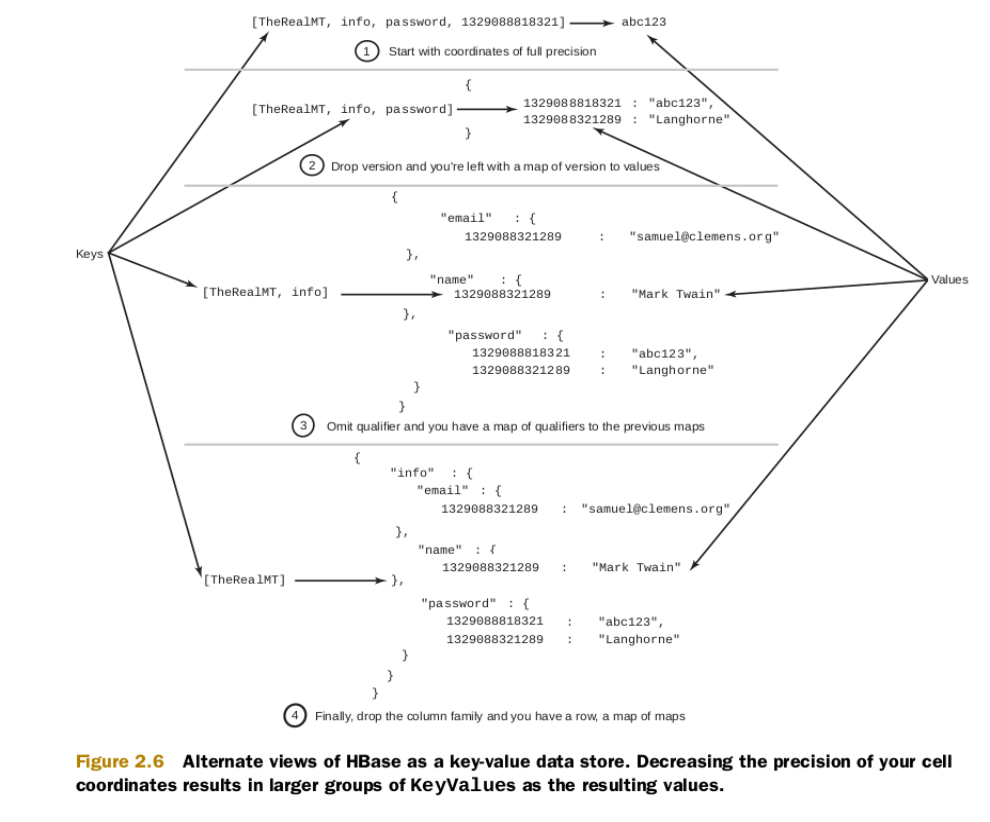

# HDFS & HBase

## HDFS

A filesystem designed for storing very large files with streaming data access patterns, running on clusters of commodity
hardware

#### Block

* Disk block size: the minimum amount of data that it can read or write.
* Filesystems for a single disk build on this by dealing with data in blocks, which are an integral multiple of the disk
  block size.
  Filesystem blocks are typically a few kilobytes in size, whereas disk blocks are normally 512 bytes.
* HDFS block size: 128MB default.

//TODO: Reason for big block size:

#### Architecture


* Using master-slave architecture

* **Namenodes**
  * Namenode manages the filesystem namespace:

    * Maintains the filesystem tree and the metadata for all the files and directories in the tree.
      This information is stored persistently on the local disk in the form of two files: the namespace image (fsImage)
      and the edit log (EditLog).

    * Namespace means a container: in this context, it means the file name grouping or hierarchy structure.

    * Keeps a reference to every file and blocks in the filesystem **in memory**

* **Datanodes**
  * Store and retrieve blocks in command of clients or the namenode.
  * Report back to the namenode periodically with lists of blocks which they are storing.

//TODO: File formats: row-based and column-based format

## HBase

### Introduction

* HBase is the Hadoop database, a distributed, scalable, big data store.
* HBase is modeled after Google’s Bigtable, provides random, realtime read/write access to Big Data.

### Terms


* Table: Data is organized into tables.
* Row:
  * Data is stored according to its row within a table.
  * Rowkeys: lexicographically sorted unique keys of rows.
* Column family:
  * Columns are grouped into column families.
  * A table must have at least one column family.
  * Column families must be defined up front and are not easily modified.
  * Every row in the table has the same column families, but a row need not store data in all its column families.
* Column qualifier:
  * Data within a column family is addressed via its column qualifier, or column.
  * Need not be specified when creating the table.
  * Need not be consistent between rows.
* Cell: combination of rowkey, column family and column qualifier.
* Version:
  * Values within a cell is versioned.
  * Versions are identified by timestamp.

### Architecture


* HMaster: coordinate the region servers and performing admin functions: create, delete and update tables.
* ZooKeeper: maintain server state in the HBase Cluster: receive heartbeat to determine servers state.
* Region: contiguous ranges of rows stored together.
* Region servers: a node in HBase cluster, which serves multiple Region.

### Data model

#### Logical

* HBase can be viewed as a key-value data store
  

* HBase can also be illustrated as a **sorted** map of maps
  

  * Described in Java:
    ```Map<RowKey, Map<ColumnFamily, Map<ColumnQualifier, Map<Version, Data>>>>```
  * The `Version` map key is sorted in descending order, while other keys are sorted in ascending order.

#### Physical


Column family oriented

* Each column family has its own HFiles, allows the underlying HFiles of one column family to be managed in isolation of
  the others.
* HBase persists data records into HFiles, an immutable file format.
* Data is stored in HFiles as binary key-value pairs without null values.
* Separated HFiles lets column families read requested column families only when retrieving data, so that provides fast
  reads of particularly sparse datasets.

### Data manipulation

#### Writing data


* Write request goes into two places by default: the WAL (HLog) and the MemStore.
* Write process is considered completed only after change is written to and confirmed in both places.
  * MemStore: an in-memory write buffer where HBase accumulates data before a permanent write.
  * WAL: record changes to recover data which not yet flushed from the MemStore when a failure occurs.

#### Reading data


* BlockCache: an LRU cache designed to keep frequently accessed data from the HFiles in memory to avoid disk reads.
* Reading a row from HBase requires:
  * Checking the MemStore for any pending modifications.
  * The BlockCache is examined to see if the block containing this row has been recently accessed.
  * Finally, the relevant HFiles on disk are accessed.

#### Deleting data

* Value will not be deleted immediately after the delete command.
* A new "tombstone" record is written to mark the value as deleted.
* Compaction: folds HFiles together, creating a larger HFile from multiple smaller HFiles.
  * Major compaction: compaction runs over all HFiles in a column family, merge all to 1 HFile.
  * The value will not actually be deleted until HBase major compaction runs.

### Flat-wide table vs Tall-narrow table

* Flat-wide table: A table with few rows but many columns.
* Tall-narrow table: A table with few columns but many rows.

|            | Flat-wide table                        | Tall-narrow table                                           |
|------------|----------------------------------------|-------------------------------------------------------------|
| Definition | A table with few rows but many columns | A table with few columns but many rows                      |
| Pros       | Row level operations are atomic        | Storage and network I/O are reduced due to fewer columns    |
| Cons       | Required more storage and network I/O  | Cannot perform operations on a full row data with atomicity |

